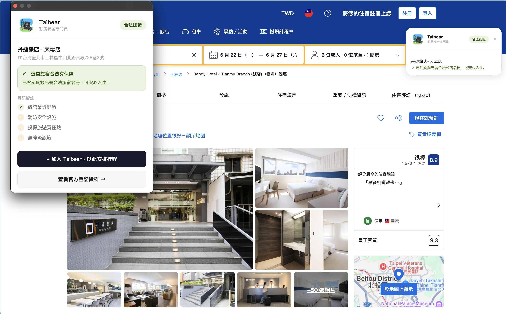
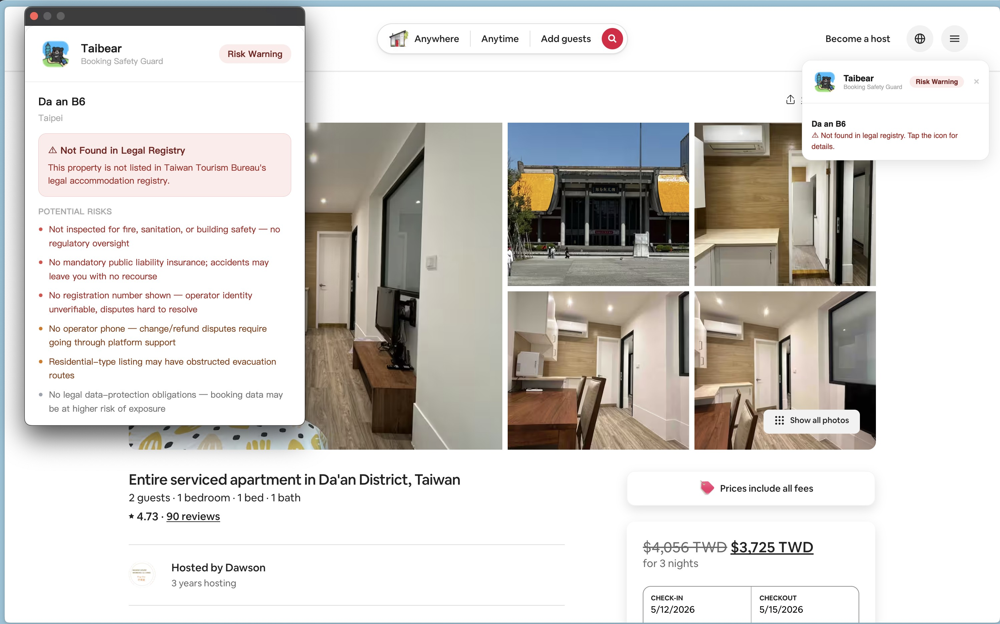
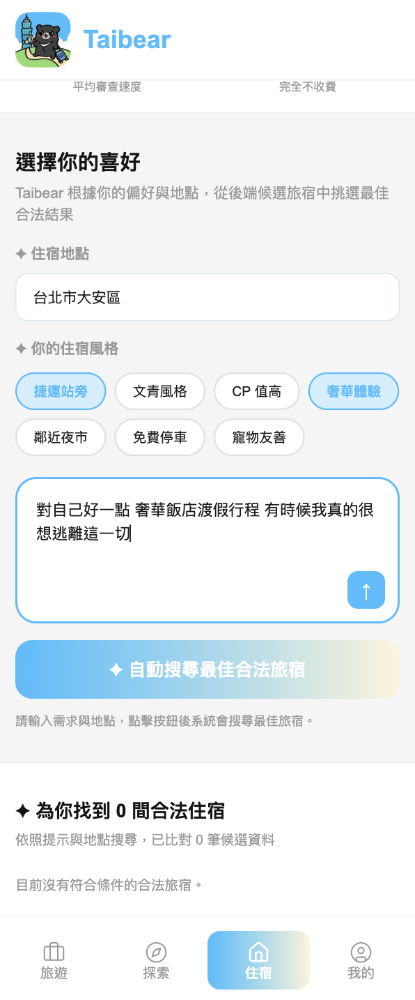
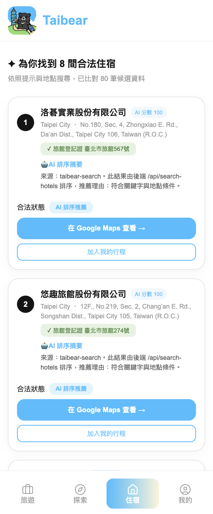
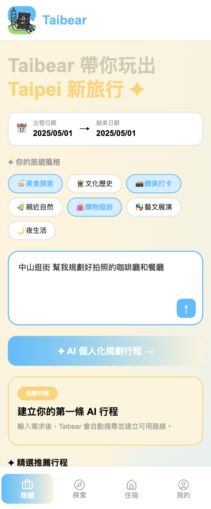
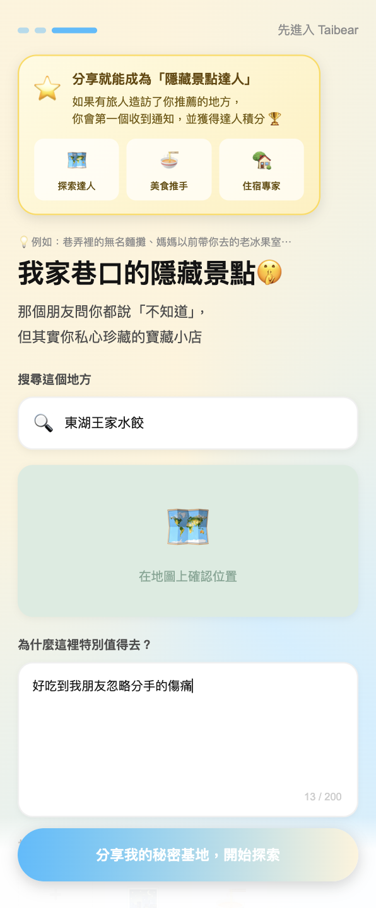

# 🐻 Taibear — 帶你玩出 Taipei 新旅行

> 從「安心訂房」到「在地探索」的完整 AI 旅伴
>
> 我們做了 **合法住宿核實 + AI 個人化行程規劃** 給 **在台旅客與在地年輕人** 用，解決「違法旅宿風險 × 旅遊資訊碎片化 × 隱藏景點無人知」。


**[🌐 立即體驗 Taibear →](http://20.18.161.44:3000/login?next=%2Fhotels)** ｜ **[🎨 簡報 →](https://drive.google.com/file/d/1nW2UayqHr-5SMuwzdR6PHLRgHs10se8j/view)**

---

<video src="docs/videos/demo.mp4" controls width="600"></video>
[Demo 影片](https://drive.google.com/file/d/1KyxQAW3z-Z5SWKTH-5JQRZJSshg4Jgps/view?usp=sharing)

---

## 🔴 問題背景

臺北作為國際觀光城市，每年吸引大量國內外
旅客造訪。然而，旅客從「規劃住宿」到「在地遊玩」的完整歷程中，仍面臨兩大資訊落差：

**住宿端**：非法日租套房透過各式訂房平台與社群刊登，外觀與合法旅宿難以區辨，旅客容易因資訊不足誤訂非法住宿，衍生消防安全、公共衛生及消費權益等風險。

**玩樂端**：現有觀光資訊多以靜態網頁或制式列表呈現，缺乏即時情境感知與個人化推薦，旅客須自行比對社群討論（PTT、Dcard、Instagram、Threads 等）決定行程，導致選擇困難、夜間經濟與巷弄商圈能見度不足。

---

## 🔴 痛點 → 解法

| # | 現在的痛點 | 誰在受苦 | Taibear 的解法 |
|---|---|---|---|
| 1 | 非法旅宿外觀與合法無異，平台無法主動核實，消費者訂房前毫無保障 | 所有訂房旅客 | **Chrome 插件**在 Booking.com／Airbnb 頁面即時比對交通部 15,585 筆合法旅宿，GPS＋執照號碼＋名稱三層驗證，發現異常立即顯示風險診斷 |
| 2 | 刷了幾百篇 IG Reels、PTT 食記仍不知道「我到底要去哪」，收藏夾永遠躺著沒用 | 自由行旅客 | **Telegram Bot** 貼上 YouTube Shorts／IG Reels 連結，AI 自動萃取地點並分類入庫；**Onboarding Quiz** 4 題建立個人旅遊輪廓標籤，讓推薦從第一步就個人化 |
| 3 | 旅遊推薦千人一面，同一條行程路線推給背包客也推給攜家帶眷的家族 | 各類型旅客 | Quiz 偏好標籤（步調、餐飲、景點主題、交通機動性）＋ Reels 語意分析，**AI 旅宿搜尋**及**行程規劃 Agent** 動態調整，不同人看到不同行程 |
| 4 | 手動排行程要比對 Google Maps、PTT、天氣、捷運路線，花數小時還不確定路線合不合理 | 自助旅行者 | **AI 行程規劃 Agent**（Google ADK ＋ Gemini 2.5 Flash）自動執行：地標 Geocoding → 缺口景點補足 → TSP 全排列路線最佳化，輸出含 smoothness score 的 3 條可執行路線與 Google Maps 導航 |
| 5 | YouBike、公車、捷運、天氣資訊分散四個 App，旅途中要頻繁切換 | 在台旅客 | **Realtime Monitor** 整合 TDX 交通部 API：即時顯示附近 YouBike 可借數量、捷運班距、公車到站，以及 Open-Meteo 天氣，行程頁直接呈現最佳交通選項 |
| 6 | 巷弄裡的老店、夜間秘境、在地小吃幾乎不出現在任何旅遊平台 | 想深度旅遊的旅客 | **「我家巷弄」**讓在地人自由投稿秘境景點；旅客「感謝推薦」後上傳者收到解鎖通知，形成持續更新的在地口碑迴圈 |
| 7 | 社群評論匿名且充斥業配，真假難辨 | 首次造訪旅客 | 認證用戶標章系統＋景點瀏覽量、推薦數公開透明，讓社群內容的可信度可量化 |

---

## 🗺️ 使用流程

```
找住宿 → 安裝插件核實 → 合法確認 → AI 搜尋最佳旅宿 → 完成 Onboarding → AI 規劃行程 → 探索在地巷弄
(Booking    (Chrome插件     (三層驗證      (LLM排序＋       (Quiz＋Reels      (Gemini Agent     (隱藏景點
  Airbnb)    即時比對)        GPS/執照)       個人化推薦)       分析偏好標籤)      TSP最佳化路線)     社群有信度)
```

---

## 🛡️ 模組一｜訂房安全核實（Safe Stay）

> 合法住宿辨識 × 風險預警

- **Chrome 插件** — 瀏覽 Booking.com、Airbnb、Agoda 訂房頁面時，即時比對交通部合法旅宿資料庫（每日自動更新）
- **三層比對引擎** — GPS 位置＋旅館登記執照號碼＋業者名稱同時核實，對應 15,585 筆合法旅宿；合法顯示「✓ 安心旅宿」，違規詳列具體缺失（地址模糊、無消防登記、業者名稱不符）
- **AI 旅宿搜尋** — 輸入地點、偏好標籤、自然語言需求，LLM 從合法旅宿中語意排序推薦，自動帶入 Onboarding 偏好標籤，附 Google Maps 連結與 AI 推薦摘要
- **一鍵加入行程** — 確認合法住宿後直接加入 Taibear，以住宿位置為起點自動規劃周邊行程

<table>
  <tr>
    <td align="center"><br/><sub>Booking.com — 合法旅宿認證</sub></td>
    <td align="center"><br/><sub>Airbnb — 違規風險警示</sub></td>
  </tr>
  <tr>
    <td align="center"><br/><sub>輸入地點與偏好</sub></td>
    <td align="center"><br/><sub>合法住宿推薦結果</sub></td>
  </tr>
</table>

---

## 🗺️ 模組二｜個人化在地探索（Play Taipei）

> AI 行程規劃 × 即時資訊 × 隱藏景點社群

- **Onboarding Quiz** — 4 題情境式問卷（步調偏好、餐飲預算、景點主題、交通機動性），建立個人旅遊輪廓標籤，後續所有推薦皆以此為基礎個人化調整
- **Telegram Bot 收藏分析** — 貼上 Instagram Reels 或 YouTube Shorts 連結，AI 自動辨識地點類型（美食／景點）、細分類（拉麵／咖啡廳／自然景觀...）並入庫，解決「收藏了但永遠不知道去哪」的問題
- **AI 行程規劃 Agent** — Google ADK ＋ Gemini 2.5 Flash，自動執行地標 Geocoding、缺口景點補足、TSP 全排列最佳化，輸出含交通時間與 smoothness score 的完整行程，附 Google Maps 一鍵導航
- **即時交通整合** — TDX API 串接 YouBike 可借數量（含一般車／電動車分項）、捷運班距、公車到站時間；Open-Meteo 提供當日天氣，行程頁直接展示最佳交通方案
- **互動式地圖探索** — 依餐廳、景點、咖啡廳、交通篩選，點擊地圖 Pin 查看景點資訊並一鍵加入行程
- **「我家巷弄」** — 在地人投稿秘境景點，瀏覽需點數解鎖，可查看真實照片、社群推薦數與在地秘笈；旅客「感謝推薦」後上傳者收到解鎖通知，形成持續更新的在地口碑

<table>
  <tr>
    <td align="center"><br/><sub>AI 個人化行程規劃</sub></td>
    <td align="center"><br/><sub>我家巷口的隱藏景點</sub></td>
  </tr>
</table>

---

## 💡 兩個模組的串連邏輯

「住哪裡安全」解決信任問題，「去哪裡好玩」解決資訊碎片問題。兩者以**住宿位置**為錨點串連——確認合法住宿後，AI 自動搜尋 10 分鐘步行圈內的巷弄景點，行程從訂房第一步就無縫展開。在地人的秘境投稿讓旅客看到平台列表以外的臺北，旅客的「感謝推薦」讓在地資訊持續流動，形成完整的智慧旅遊服務鏈。

---

## 🔗 SEO 正向連結策略｜訂房安全插件頁

插件安裝頁不只是功能介紹頁，也承擔**引導正確旅宿生態**的責任。我們在頁面內整合「相關新聞報導」區塊，策略性放置三類外部連結：

| 類型 | 來源 | 用途 |
|---|---|---|
| 深度報導 | 中央社（雙北近 9 成 Airbnb 房源不合法） | 提升旅客風險意識，建立問題嚴重性認知 |
| 官方查驗 | 交通部觀光署・臺灣旅宿網合法登記查驗平台 | 導流至政府官方核實管道，建立公信力背書 |
| 合法申辦 | 旅宿業合法登記申請流程（觀光署） | 引導有意出租的房東走向合法化，從源頭縮減非法供給 |

**設計意圖**：讓插件頁成為旅宿資訊的可信入口，而非只針對旅客的單向工具。旅客看到風險認知，房東看到合法申辦管道，監管單位的官方資源獲得更多曝光——三方都受益，也強化 Taibear 作為中立資訊平台的品牌定位。

---

## 🔌 Chrome Extension

本資料夾為 Taibear Chrome 插件原始碼。

### 支援平台
- [Booking.com](https://www.booking.com)
- [Airbnb](https://www.airbnb.com)

### 功能
- 進入房源頁面自動偵測，右上角彈出合法 / 風險警示
- GPS + 執照號碼 + 名稱三層比對，對應交通部 15,585 筆合法旅宿
- 違規房源依缺失資訊（地址、電話、執照）產生個人化風險診斷
- 合法房源一鍵加入 Taibear 安排行程

### 本地啟動
```bash
# 安裝依賴
pip install fastapi uvicorn

# 啟動本地 API（不需要資料庫）
cd Hotel-json
uvicorn hotel_api_local:app --port 8000

# Chrome 載入插件
# chrome://extensions/ → 開啟開發人員模式 → 載入未封裝項目 → 選此資料夾
```

---

## ⚙️ 技術棧

| 層面 | 技術 |
|---|---|
| 合法旅宿資料庫 | PostgreSQL × 交通部開放資料集（每日更新） |
| 瀏覽器插件 | Chrome Extension Manifest V3（Booking.com／Airbnb／Agoda） |
| AI 行程規劃 | Google ADK ＋ Gemini 2.5 Flash ＋ TSP 全排列路線最佳化 |
| AI 旅宿搜尋 | LLM 語意排序 ＋ 使用者偏好標籤加權 |
| 社群內容收集 | Telegram Bot ＋ IG Reels／YouTube Shorts AI 地點萃取 |
| 即時交通資訊 | TDX API（YouBike 2.0 ／捷運／公車）＋ Open-Meteo 天氣 |
| 地圖與導覽 | Google Maps API ＋ Google Places ＋ Distance Matrix |
| 前端框架 | Next.js ＋ Tailwind CSS（RWD，支援桌機＋手機） |
| 個人化推薦 | Onboarding Quiz 標籤 ＋ Reels 語意分析 ＋ 協同過濾 |

---

## 🎯 對應賽題最終目標

- ✅ **便民化服務網站** — 整合式網站介面涵蓋訂房核實、AI 旅宿搜尋、行程規劃、即時地圖探索、景點投稿
- ✅ **AI 智能代理人** — Gemini 2.5 Flash Agent 以對話與 prompt 完成住宿核查、TSP 行程規劃與即時推薦
- ✅ **即時情境感知** — TDX 交通 API ＋ 天氣整合，行程頁直接呈現當下最佳交通方案
- ✅ **社群有信度機制** — 在地秘境投稿＋感謝回饋通知，讓旅遊資訊持續更新且可量化信度

---

*2026 YTP 電客松 · 賽題 A 行旅台北 · Taibear — 安心訂，玩得深*
